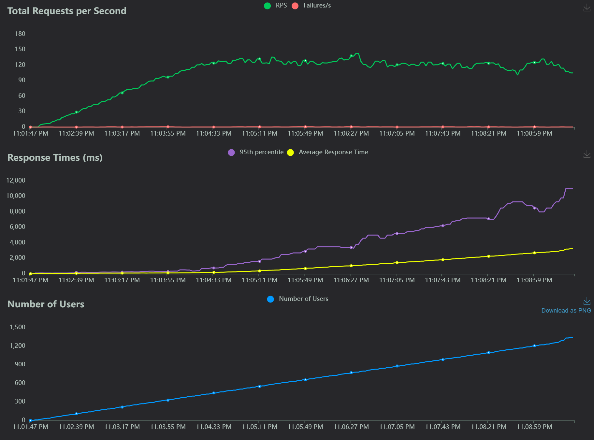

# My Chat App

This project contains a chat application with a front-end built using React and a back-end built using FastAPI. The application is designed to provide a user-friendly chat interface where users can interact with a bot named "SizeBot" The back-end is optimized to handle multiple concurrent requests and includes a comprehensive test suite to ensure functionality and performance. The front-end leverages the `@chatscope/chat-ui-kit-react` library for a sleek and responsive UI, chosen for its popularity, ease of use, active development, and performance. FastAPI was selected for the back-end due to its high performance, modern features, ease of use, and strong community support.

## Table of Contents
1. [Project Structure](#project-structure)
2. [Setup and Running the Application](#setup-and-running-the-application)
   - [Using Docker](#using-docker)
   - [Without Docker](#without-docker)
3. [Running Locust Load Test](#running-locust-load-test)
4. [Proposals for Additional Improvements](#proposals-for-additional-improvements)
5. [Data Modeling](#data-modeling)
6. [Code Readability and Maintainability](#code-readability-and-maintainability)
7. [Back-end Performance](#back-end-performance)
   - [Stress Testing](#stress-testing)
   - [Performance Results](#performance-results)
   - [Conclusion](#conclusion)


## Setup and Running the Application

### Using Docker

#### Prerequisites

- Docker Desktop installed

#### Steps

1. **Clone the repository**:
   ```bash
   git clone https://github.com/cheikhmc/my-chat-app.git
   cd my-chat-app
   ```

2. **Build the Docker containers**:
    ```bash
    docker-compose build
    ```

3. **Run the Docker containers**:
    ```bash
    docker-compose up
    ```
4. **Access the application**
- Front-end: `http://localhost:3000`
- Back-end: `http://localhost:8000/api/chat`

### Without Docker
#### Prerequisites
- Node.js (https://nodejs.org/)
- Python 3.11+ or any valid version
- virtualenv (optional but recommended)
#### Front-end Setup
##### On Linux
- Navigate to the root directory:

```bash
cd my-chat-app
```
- Run the front-end script:

```bash
./run_frontend.sh
```
##### On Windows
- Navigate to the root directory:

```cmd
cd my-chat-app
```
- Run the front-end script:

```cmd
run_frontend.bat
```
#### Back-end Setup
##### On Linux
- Navigate to the root directory:

```bash
cd my-chat-app
```
- Run the front-end script:

```bash
./run_backend.sh
```
##### On Windows
- Navigate to the root directory:

```cmd
cd my-chat-app
```
- Run the front-end script:

```cmd
run_backend.bat
```
### Running Locust Load Test
#### Prerequisites
- Locust installed (pip install locust)
### Steps
- Ensure Docker containers or apps without docker are running:

```bash
docker-compose up
```
#### Run Locust:
- Open a new terminal, navigate to the back directory, and run:

```bash
cd back
locust -f locustfile.py --host=http://localhost:8000
```
Access the Locust web interface:
- Open your web browser and go to http://localhost:8089.

- Configure and start the test:

- Number of total users to simulate: Enter the total number of concurrent users.
- Spawn rate (users spawned/second): Enter the rate at which to spawn new users.
- Host: Ensure it is set to http://localhost:8000.
- Click the Start Swarming button.
- Load Test Results
- Here are the results from the Locust load test:



#### Interpretation of Results
- Total Requests per Second: The graph shows the total number of requests per second handled by the server. It remained relatively stable with slight fluctuations, indicating consistent handling of incoming requests.

- Response Times (ms): The response times increased as the number of users grew. The average response time remained low initially but gradually increased, indicating the server's capacity to handle requests up to a certain limit before performance degradation.

- Number of Users: The graph shows a steady increase in the number of users over time, simulating a gradual load increase on the server.

### Proposals for Additional Improvements
1. **Authentication and Authorization**
- Concrete Example: Implement user authentication using OAuth2 or JWT to secure the chat application.
- Use Case: In an e-commerce setting, authenticated users can receive personalized size recommendations based on their purchase history.

2. **Persistent Storage**
- Concrete Example: Integrate a database like PostgreSQL to store chat history and user data.
- Use Case: Store previous chat interactions to provide context-aware responses, improving the user experience by recalling past interactions.

3. **Enhanced Front-end UI/UX**
- Concrete Example: Add sophisticated UI elements such as animations, loading spinners, and transition effects to improve user interaction.
- Use Case: Implement a more interactive and visually appealing chat widget that can expand, minimize, and close smoothly, enhancing the user experience on the e-commerce site.

4. **Scalability**
- Concrete Example: Implement auto-scaling using Kubernetes to dynamically manage increased load. Set up horizontal pod autoscaling to handle traffic spikes efficiently.
- Use Case: During peak shopping seasons, the system can automatically scale to handle the increased number of users, ensuring the chat service remains responsive.

5. **Connect with an AI or LLM for the Chatbot**
- Concrete Example: Integrate the chatbot with a Large Language Model (LLM) such as OpenAI's GPT-3 to provide more intelligent and context-aware responses.
- Use Case: The chatbot can offer personalized size recommendations based on user input and historical data, improving the shopping experience. For example, the bot can understand queries like "What size should I get for running shoes?" and provide relevant suggestions.

6. **Production-Ready Enhancements**
- a. ***Rate Limiting***
Concrete Example: Implement rate limiting using libraries like slowapi with FastAPI to prevent abuse and ensure fair usage of the API.
Use Case: Protect the back-end from being overwhelmed by too many requests in a short period, ensuring consistent performance for all users.

- b. ***Nginx as a Proxy Server***
Concrete Example: Use Nginx as a reverse proxy to handle incoming requests, distribute traffic, and improve security.
Use Case: Nginx can balance the load between multiple instances of the back-end service, providing better performance and reliability.

- c. ***HTTPS with Let's Encrypt***
Concrete Example: Secure the API with HTTPS using Let's Encrypt to provide SSL/TLS certificates.
Use Case: Ensuring all data transmitted between the client and server is encrypted, protecting user data and improving security compliance.

### Data Modeling
#### The data model consists of two main components:

- Message: Represents a single chat message with attributes sender and text.
- ChatHistory: Represents the chat history as a list of Message objects.
This simple and effective data model ensures that the back-end can handle chat interactions efficiently.

### Code Readability and Maintainability
The codebase is organized into clear modules with descriptive names, making it easy to navigate and understand. Key practices include:

- Separation of Concerns: Different functionalities are separated into distinct modules.
- Descriptive Naming: Variables, functions, and classes are named descriptively, improving readability.
- Docstrings and Comments: Added to explain complex logic and provide context.
### Back-end Performance
#### Stress Testing
- The back-end is stress-tested using Locust to simulate multiple concurrent users. Metrics such as requests per second, response time, and failure rate are monitored to ensure the server performs well under load.

#### Performance Results
- Concurrent Handling: The server efficiently handles high numbers of concurrent requests due to the asynchronous nature of FastAPI and the use of Uvicorn workers.
- Response Time: Maintains low response times even under heavy load.
- Scalability: The use of Gunicorn with multiple workers allows the server to scale effectively.